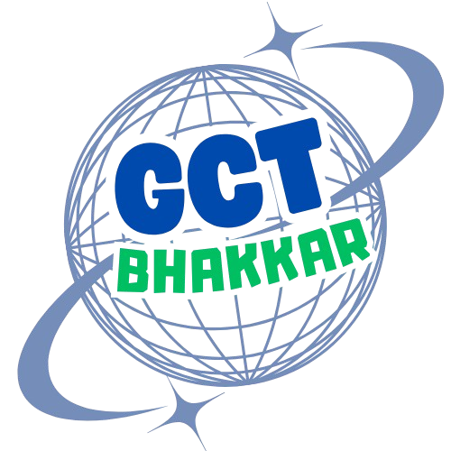

# GCT Bhakkar - Government College of Technology Website



A modern, responsive website for Government College of Technology, Bhakkar. Built with a modular architecture featuring reusable components and a consistent design system.

## 🌟 Features

- **Modern Design** - Clean, professional UI with smooth animations
- **Responsive** - Mobile-first design that works on all devices
- **Dynamic Components** - Reusable navbar and footer via JavaScript
- **CSS Design System** - Consistent theming with CSS variables
- **Scroll Animations** - Engaging animations on scroll
- **Counter Animations** - Animated statistics when visible
- **SEO Optimized** - Proper meta tags and semantic HTML

## 🛠️ Tech Stack

- **HTML5** - Semantic markup
- **CSS3** - Custom properties, Flexbox, Grid
- **JavaScript** - Vanilla JS for components
- **Bootstrap 5** - Layout utilities
- **Font Awesome** - Icons

## 📁 Project Structure

```
gct-bhakkar-website-design/
├── index.html                  # Home page
├── pages/
│   ├── about.html             # About Us
│   ├── programs.html          # All Programs
│   ├── admissions.html        # Admissions Info
│   ├── contact.html           # Contact Page
│   ├── campus-life.html       # Campus Life
│   └── departments/           # Department pages
│       ├── cit.html
│       ├── electrical.html
│       ├── mechanical.html
│       ├── civil.html
│       └── electronics.html
├── assets/
│   ├── css/                   # Stylesheets
│   │   ├── base/              # Variables, reset, typography
│   │   ├── components/        # UI components
│   │   ├── layouts/           # Section layouts
│   │   └── main.css           # Entry point
│   ├── js/                    # JavaScript
│   │   ├── components/        # Dynamic components
│   │   ├── utils/             # Utilities
│   │   └── main.js            # Entry point
│   └── images/                # Image assets
└── README.md
```

## 🚀 Getting Started

### Prerequisites
- Node.js (for development server)
- Modern web browser

### Installation

1. Clone the repository:
```bash
git clone https://github.com/Abdul-Rasheed-Talal/gct-bhakkar-website-design.git
cd gct-bhakkar-website-design
```

2. Start a development server:
```bash
npx http-server -p 5500
```

3. Open in browser:
```
http://127.0.0.1:5500
```

## 📄 Pages

| Page | Description |
|------|-------------|
| Home | Hero carousel, departments, statistics, campus life |
| About | Mission, vision, facilities |
| Programs | All departments with comparison |
| Admissions | Process, requirements, fees |
| Contact | Form, map, contact info |
| Campus Life | Facilities and activities |
| Departments | Individual pages for each technology |

## 👥 Team

- **Abdul Rasheed** - Project Lead, Header/Footer, Index Page
- **Ali Raza** - Departments Section
- **Imran** - Why Choose Us Section
- **Naseer Nawaz** - Campus Life Section
- **Hammad Ali** - Footer Design

## 📝 License

This project is created for educational purposes for GCT Bhakkar.

---

**Government College of Technology, Bhakkar**  
*Excellence in Technical Education*
